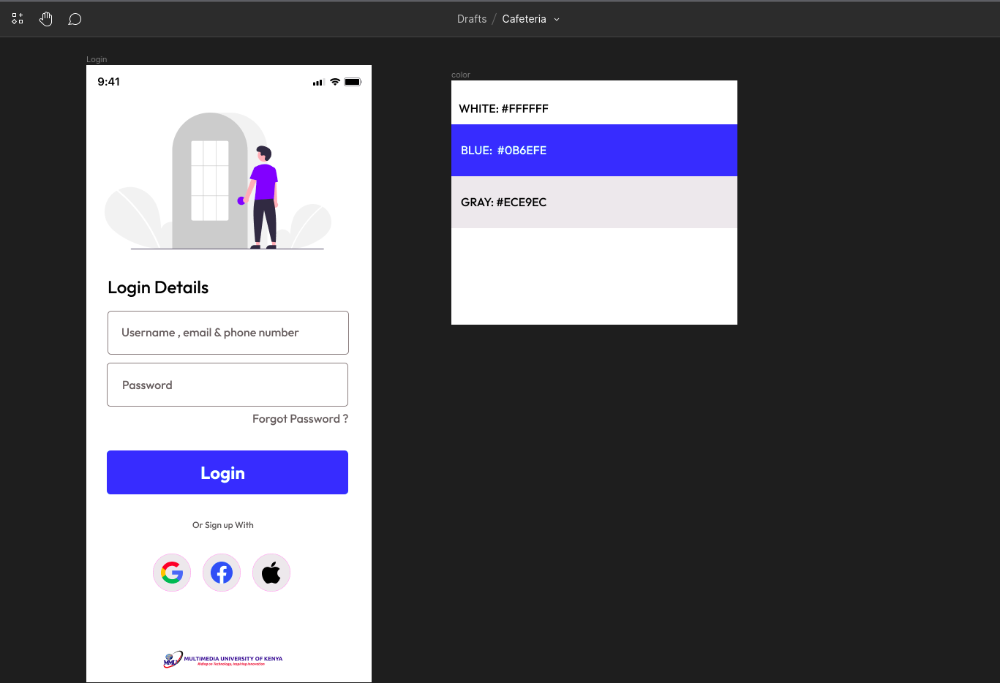

# compose-intro-assets
In this Episode we are going to build a login page for a cafeteria App. [Click here](https://www.figma.com/file/kvxD0mA1Ehrii1kUTt9msG/Cafeteria?node-id=0%3A1) to see the figma design

## Assets preview
<image src='ic_mmu_logo.png' width=200 height=64/><image src='ic_apple.png' width=64 height=64/> <image src='ic_facebook.png' width=64 height=64/><image src='ic_google.png' width=64 height=64/>

## Figma design

## Credits
- https://undraw.co/ (Illustrations)
